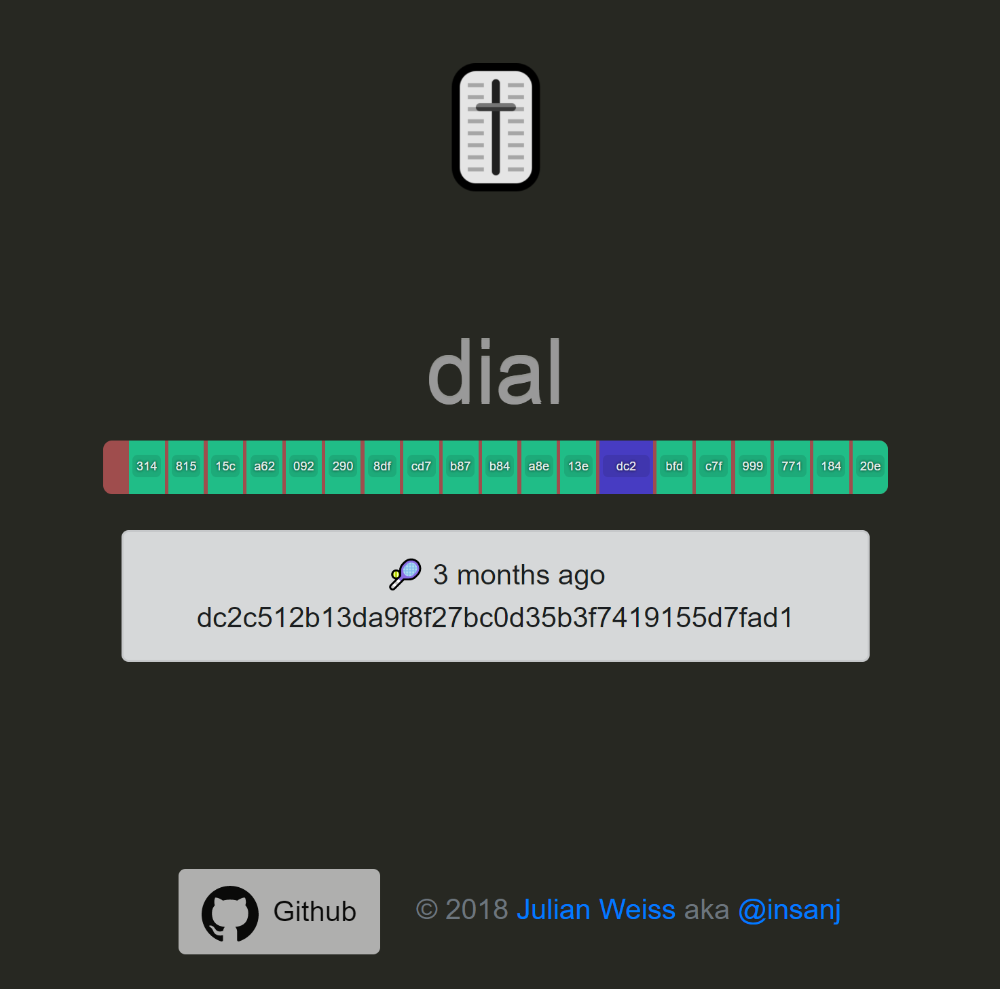

   
   <h3 align="center">dial</h3>
   <h4 align="center">timeline-like UI for navigating a large dataset</h4>

## Usage

 

## Built with

- [jquery/jquery](https://github.com/jquery/jquery)

Example uses:
- [twbs/bootstrap](https://github.com/twbs/bootstrap)
- [hustcc/timeago](https://github.com/hustcc/timeago.js)

## License

See [LICENSE](LICENSE). Please reach out to me on [🐤 Twitter](https://twitter.com/insanj) or [🚀 GitHub](https://github.com/insanj) if you'd like to use dial for something cool!
